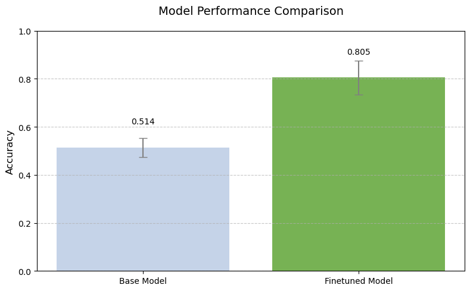

This repository contains a handcrafted reimplementation of the Low-Rank Adaptation (LoRA) technique, designed to fine-tune large language models efficiently by optimizing smaller low-rank parameter updates.\
Developed as part of a university project, it showcases the principles and practical application of LoRA for lightweight model customization.

Only the results and highlights are reported here; the full implementation code can be found in the notebook.
# Introduction

I am a passionate supporter of online gaming, and one relevant issue within the online gaming community is the toxicity exhibited by some players. Addressing this problem is indeed a challenging task.

As I will show in the model section, identifying toxic behavior is difficult with standard sentiment analysis. This is because certain sentences flagged as negative may actually make complete sense within the context of the game.

The dataset selected for this project consists of an extensive collection of chat logs from one of the most famous multiplayer online games: **League of Legends**. It is available on [Kaggle](https://www.kaggle.com/datasets/simshengxue/league-of-legends-tribunal-chatlogs) and originates from a platform provided by the game's company, which made these logs accessible.

# Code
The model I chose is Google's [T5](https://arxiv.org/abs/1910.10683). It adheres to the standard encoder-decoder architecture and operates as a multi-task model in the text-to-text format.\
I opted for the "small" version (60M parameters) as it seemed like the most practical choice for efficient training and execution on limited resources. Despite its smaller size, it still managed to yield good results after the fine-tuning process.

I aimed to fine-tune the model using LoRA's approach. Following the LoRA [paper's](https://arxiv.org/abs/2106.09685) recommendations, I applied LoRA to the $q$ and $v$ matrices in the attention layers, both within the encoder and decoder of the model.

The `transformer` module is used solely for downloading the model from [Hugging Face](https://huggingface.co/google-t5/t5-small). Everything else, from generation to defining LoRA components and training, is accomplished in TensorFlow.

```python
from transformers import T5TokenizerFast, TFT5ForConditionalGeneration
import transformers

tokenizer = T5TokenizerFast.from_pretrained("t5-small")
model = TFT5ForConditionalGeneration.from_pretrained("t5-small")  # load the model with tensorflow
```
## LoRA Implementation
I had to define a new type of layer (`LoraDense`) in order to inject low rank matrices in the model.
The `dense` attribute of this new model represent the orginal dense layer of $q$ or $v$ in the attention layers.

I also had to create a model-trainer subclass to customize the fit method.
```python
# tensorflow implementation of the pytorch code from the orginal paper
# https://github.com/microsoft/LoRA/blob/main/loralib/layers.py
class LoraDense(tf.keras.layers.Layer):

  def __init__(self, config, rank=8, **kwargs):
    super().__init__(**kwargs)
    self.dense_config = config      # initialize and copy the original dense
    self.dense = tf.keras.layers.Dense.from_config(self.dense_config)
    self.dense.trainable = False   # set the original dense layer as non trainable

    self.r = rank

  def build(self, dense_build_config, weights):
    in_dim = weights[0].shape[0]
    out_dim = weights[0].shape[1]

    self.dense.build_from_config(dense_build_config)
    self.dense.set_weights(weights)          # copy the original weight of the model

    # Add low rank matrices
    self.B = self.add_weight(shape=(in_dim,self.r),
                              initializer='zeros',    # B initialized with all zeros
                              trainable=True,
                              name="Lora_B")
    self.A = self.add_weight(shape=(self.r,out_dim),
                              initializer='random_normal',   # A initialized at random
                              trainable=True,
                              name="Lora_A")
    self.built = True

  def call(self,x):
    W = self.dense(x)  # orginal output
    BA = self.B @ self.A

    return W + x@BA  # modified output

# https://www.tensorflow.org/guide/keras/customizing_what_happens_in_fit
class LoraCustomTrainer(TFT5ForConditionalGeneration):
  def __init__(self, *args, **kwargs):
    super().__init__(*args,**kwargs)

  @tf.function
  def train_step(self,data):
    x,y = data

    with tf.GradientTape() as tape:
      loss = self(input_ids=x, labels = y).loss # compue the loss

    trainable_variables = []

    # we need to iterate over all the layers because model.trainable_weights does not return weights
    for l in self.encoder.submodules:
      if isinstance(l,transformers.models.t5.modeling_tf_t5.TFT5Attention):
        trainable_variables += l.q.trainable_weights  # add lora parameters from q
        trainable_variables += l.v.trainable_weights  # add lora parameters from v

    for l in self.decoder.submodules:
      if isinstance(l,transformers.models.t5.modeling_tf_t5.TFT5Attention): # same cycle on the decoder
        trainable_variables += l.q.trainable_weights
        trainable_variables += l.v.trainable_weights

    grads = tape.gradient(loss, trainable_variables)

    self.optimizer.apply_gradients(zip(grads, trainable_variables))  # apply gradients

    return {"loss":loss}
```

# Results
Full training details can be found in the notebook.

The fine-tuned model demonstrated a substantial improvement over the base model's accuracy, with the training of only a small fraction of parameters using LoRA.\
While there is room for enhancements, this result remains remarkable, particularly considering the modest size of the model.


